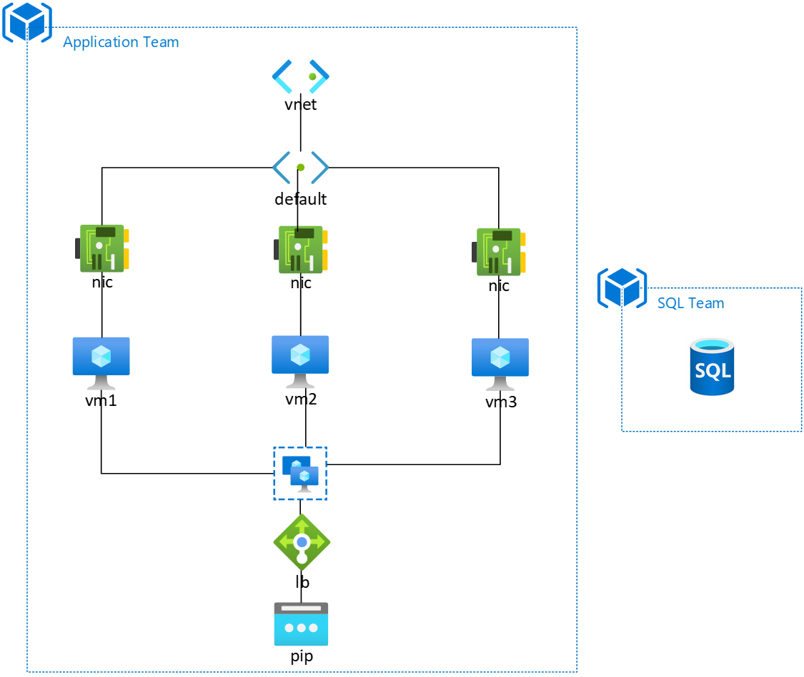

# Azure Application Scenario Troubleshooting Workshop
Created this workshop for my customer as they wanted a *real-world* application deployed into Azure that would break. The task of the workshop would then be identifying the break and then implementing Azure functionality to monitor/alert/react to the break. We ran this workshop in 5 hours.

My customer uses Azure CLI and bash so this workshop caters to this.

## Workshop Scenario Overview
The participants of the workshop oversee the ASP.NET MVC web frontend for the Music Store 'ASP.NET MVC Music Store'. The application is deployed across three VMs that are load balanced. The application communicates to a Azure SQL server database. There are six scenarios:
1. A member of your team has pushed the latest code to production but it has not gone to plan. Customers are ringing up that the website is no longer functioning.
Investigate the issue and implement functionality that will alert to any downtime. 
2. A member of your team has noticed that the website is no longer functioning. Investigate the issue and implement functionality that will alert to any downtime. 
3. The SQL database team are reporting no traffic to their SQL database for the application. Investigate why this is and how this can be prevented in the future.
4. The management of the organisation are conducting a BCDR audit of all applications for the music store. Implement functionality that will allow the application to return to as-is in the event of a disaster. Your current RTO is 30 minutes.
5. Customers are ringing up complaining that the website is running slowly and receiving the occasional gateway timeout. They’re using the telephone ordering service instead. Investigate why the website is operating slowly and what functionality can be implemented to prevent this in the future.
6. It’s been all over the news – the ransomware WAN2CRY is being spread amongst the internet and somehow ended up on our web farm. Our website is not operational. Restore the service and meet our RTO of 30 minutes.

The generated `./client/break/*.sh` scripts then break the environment by:
1. Introducing a new route to the route table that prevents traffic getting to the SQL server
2. Killing the IIS service (`iisreset /stop`)  on the VMs in the resource group
3. Adding an outbound rule to all NSGs in the resource group blocking the SQL Server
4. BCDR Review of the Application (introduction of features to prevent a disaster)
    - Didn't reveal to the participants but the final task deletes the web folder and so this task prepares for the final one
5. Downloading and executing a PowerShell script to max out CPU on the servers (`stress.ps1`)
6. Executing a script to delete the web folder on the VMs (`wan2cry.ps1`)

The participants should not worry about the SQL team/SQL server as this is out of their remit and hosted by another team. The resource for this sits in your subscription.

### Possible Solutions
Everyone in the workshop I ran had different solutions. I've just jotted down some possible solutions.

1. - **Identify**: Use the Network tooling under Azure Monitor to identify the issue, create an RDP rule for the VM and troubleshoot on the VM, view the IIS logs where the connection will be failing .etc
    - **Fix**: NPM to monitor the connection to the Azure SQL instance, alerting via Log Analytics on the IIS logs .etc
2. - **Identify**: Look up the health of the load balancer, investigate on the Virtual Machine the service .etc
    - **Fix**: Alerting on the load balancer, Azure automation account to restart the host if no response on port 80 .etc
3. - **Identify**: Similar to 1, use the Networking stack .etc
    - **Fix**: NPM to monitor the connection to the Azure SQL instance, alerting via Log Analytics on the IIS logs .etc
4. - **Identify**: BCDR
    - **Fix**: Implement Recovery Services (Backups), Site Recovery (although this wouldn't work with the break), open up the ARM template and get the 'CustomScriptExtension' .etc
5. - **Identify**: View metrics on the Virtual Machine for CPU, look on the VM for the spike in CPU .etc
    - **Fix**: Azure Monitor alerting, Azure Automation for reboot .etc
6. - **Identify**: Load Balancer Health will be at 0%, web folder disappeared .etc
    - **Fix**: Restore backup, redeploy application code .etc

## Application Topology


## How To Deploy

### Host
- Change the variables in `./deploy.sh` on lines 3-9
- Execute `./deploy.sh`. The script will deploy the ARM template, set up the host files, copy the files to the storage account, set up the client files and then place these in a folder called '`./client`'
- The '`./client`' folder can then be zipped and shared with the participants of the workshop

### Client
- Distribute the `./client` folder (I zip it up and then share via a Storage Account with a https://aka.ms link)
- Change the variables `RESOURCE_GROUP` and `RESOURCE_PREFIX` in `./client/_variables.sh` to be unique to the participant. If two participants have the same strings, the deployment may fail as the resource names are not unique
- Execute `./client/deploy.sh` within the distributed `./client` folder
- Solution is deployed to Azure (~20-25 minutes)
- Step through PowerPoint and execute tasks in `./client/break/*.sh`

## How the scenario is constructed

The following is deployed to the host subscription:
- Azure SQL Server hosting the Music Store database
- Storage Account hosting the Azure CLI commands to break the environment within the client's subscription

Both resources are used by all participants.

The files within the directory `./templates/*` are modified to reflect the host deployment and dumped in either `./host/` or `./client/`. The files in `./host/*` are uploaded and stored on the host storage account. The client files are then ammended to reflect the deployment and stored in `./client/*`. Review `./deploy.sh` for further detail.

### Host Files

The `./host` folder is only used at the time of executing `./deploy.sh`. Files are modified to reflect the host deployment and then uploaded from this folder to the storage account.

### Client Files

The client scripts located in `./client/break/*.sh` post-execution of `./deploy.sh` are ciphered using a `tr` command:

```bash
echo "This is a text string" | tr '[A-Za-z]' '[N-ZA-Mn-za-m]'
Guvf vf n grkg fgevat
```
```bash
echo "Guvf vf n grkg fgevat" | tr '[N-ZA-Mn-za-m]' '[A-Za-z]'
This is a text string
```
This prevents the prying eye from instantly seeing the Storage Account URI for the Azure CLI commands, downloading this file and then seeing how the break happens.

The `./client/break/*.sh` scripts effectively decipher themselves, `curl` a script from the host's Storage Account (`./host/break/*.sh`), execute this script and in some cases, pass this output to another script that is again curled (`./host/break/*a.sh`).

## Footnotes
The command `iisreset` may have to be ran on the/sent to the VM after some networking alterations to drop/reset any open connections. Example being tasks 1 and 3, after fixing the broken application, an `iisreset` was necessary (or you can wait a period of time).

Enjoy.